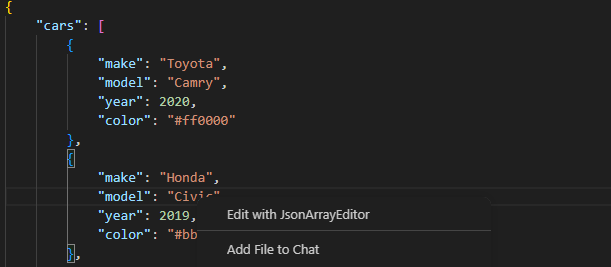
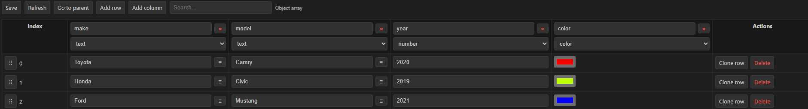

# JsonArrayEditor

JsonArrayEditor is a lightweight VS Code extension that opens a spreadsheet-style editor for JSON arrays directly from the editor context menu.

## Features

- Adds **Edit with JsonArrayEditor** to the context menu for JSON and JSONC files
- Opens the array at the current cursor position
- Supports:
  - arrays of objects, such as `[{...}, {...}]`
  - arrays of primitive values, such as `[1, 2, 3]`, `["a", "b"]`, and `[true, false]`
- Uses the union of object keys as spreadsheet columns
- Lets you add rows, clone rows, add columns, and rename columns
- Supports per-column types: `text`, `number`, `bool`, and `color`
- Displays nested arrays as text and provides an **Open child** action

## Usage

Open a JSON or JSONC file, place the cursor inside an array, and right-click to choose **Edit with JsonArrayEditor**.